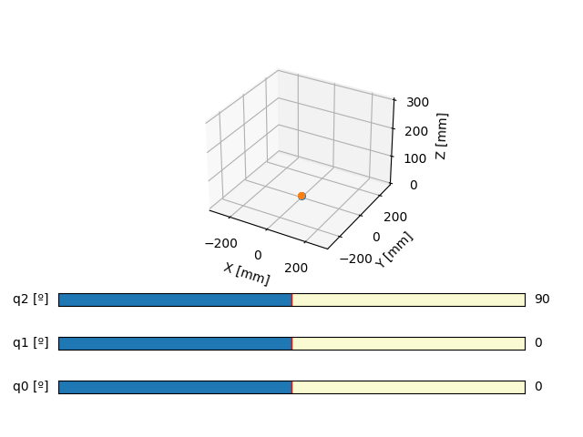
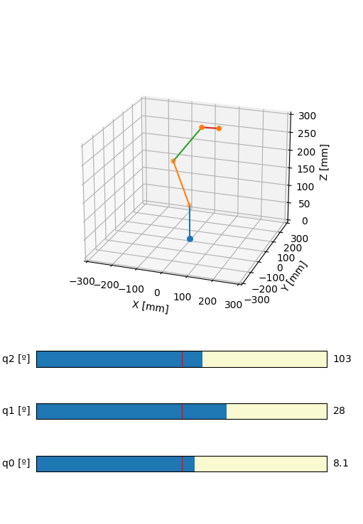

# Tarea 2: Robot Antropomórfico

El objetivo de esta tarea es que logres representar el modelo de un robot antropomórfico, calculando las matrices de traslación y rotación necesarias.
Esta tarea tiene 2 partes:
1. Completar las funciones del archivo `transformations.py`, las cuales deben retornar cada una de las matrices de transformaciones de manera correcta
2. Asignar correctamente el valor de cada ángulo de rotación para cada link del modelo del robot dentro del método `_update_transformation_matrices`
3. Completar el método `update_pose` de la clase `MK2Robot`, del archivo `mk2robot.py`, la cual debe calcular la pose de cada link del robot, usando las matrices T y R. Luego guardar elresultado para cada link como un elemento del arreglo `self.pose`

**IMPORTANTE:** El archivo `tarea_2.py` es para que pruebes tu solución de la tarea y veas el modelo tri-dimensional del robot. Dado que inicialmente están todos los valores de matrices en cero (`T`, `R`, `pose`, etc.), verás sólo el siguiente gráfico charcha:
 

Una vez que la tarea esté terminada, el modelo del robot se verá así y podrás jugar con los *sliders*!

